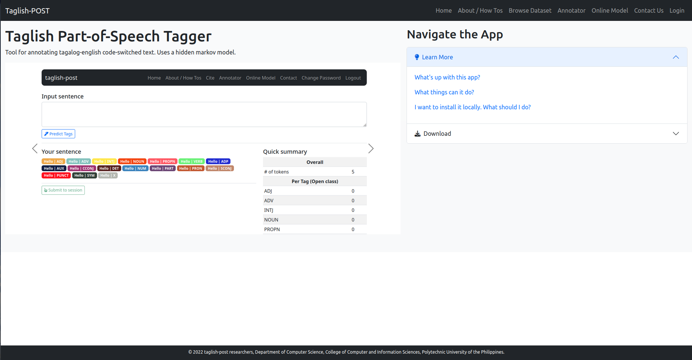
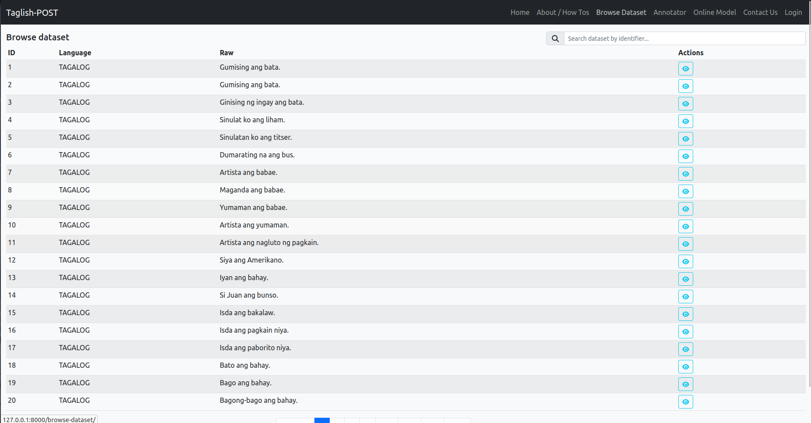
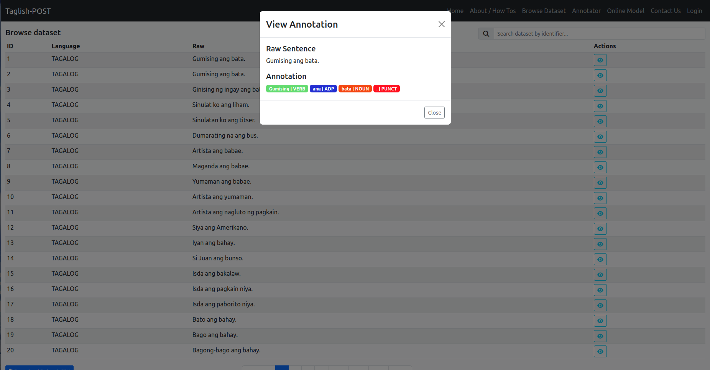
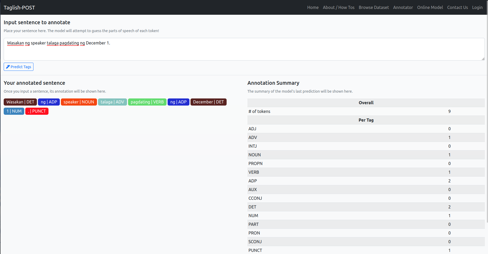
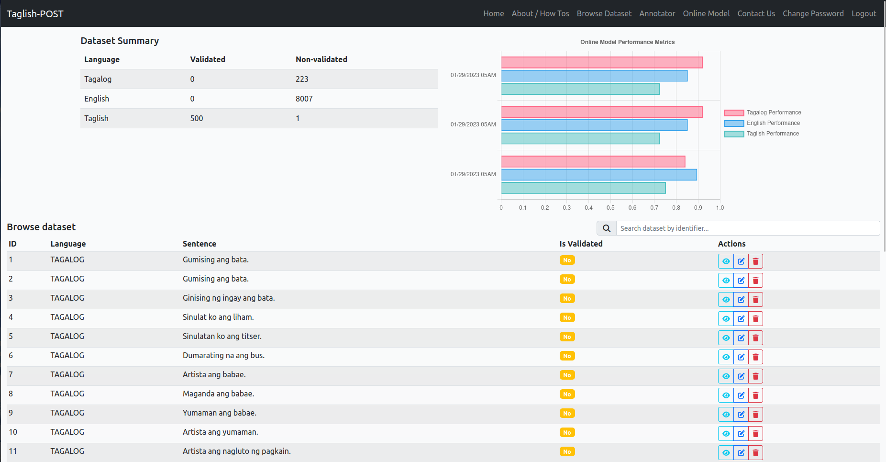

<!-- PROJECT SHIELDS -->
[![Stargazers][stars-shield]][stars-url]
[![Issues][issues-shield]][issues-url]

  <h3 align="center">Taglish MEMM Part-of-Speech Tagger</h3>
  

    A part-of-speech tagger trained for Taglish, loaded on a website.
  

## About the Project

This project is a web application which contains a Maximum Entropy Markov Model
Part-of-Speech tagger trained on all Tagalog, English, and Taglish code-switching
text.

The website allows for demonstration of the model which shows the resulting
annotation of a sentence.

### Auto-Trainer Module

The web application contains a module which retrains the part-of-speech tagger model
automatically by a scheduled job using Django-Q.

The model is trained with the labelled dataset stored in its database.

### Dataset

The dataset used to train the model is the combination of the following sources:

1. Universal Dependencies: English GUM Set (only the training split) -
<a href="https://universaldependencies.org/treebanks/en_gum/index.html">link</a>

1. Universal Dependencies: Tagalog Ugnayan Set -
<a href="https://universaldependencies.org/treebanks/tl_ugnayan/index.html">link</a>

1. Universal Dependencies - Tagalog TRG Set -
<a href="https://universaldependencies.org/treebanks/tl_trg/index.html">link</a>

1. The TweetTaglish Dataset -
<a href="https://aclanthology.org/2022.lrec-1.225/">link.</a> This dataset is
unannotated and is therefore labelled by the researchers in accordance with
<a href="https://deepblue.lib.umich.edu/handle/2027.42/139623">
    Joseph Lesada's Analysis on Taglish Code-Switching</a>.

All inputs to the online model page are also saved and is used for re-training
(a semi-supervised machine learning approach). They are initially tagged as unvalidated
which can be used to determine what sentences need to be rechecked in case the model
health fails.

## Built With

This website is built with the following technologies:

[![Python][Python-shield]][Python-docs]
[![Django][Django-shield]][Django-docs]
[![ReactJS][ReactJS-shield]][ReactJS-docs]

Additionally, the model is built with the popular
<a href="https://www.nltk.org/">Natural Language Toolkit</a>.

## Installation

Install the following beforehand:

1. Python 3.x
1. pipenv - `pip install pipenv`
1. Node.JS 18

To run on your development machine, do the following steps:

1. Clone the repo - `git clone https://github.com/QueebSkeleton/taglish-hybrid-integrated-hmm-pos.git`
1. Open the project directory on your terminal.
1. Install dependencies - `pipenv install`
1. Run a shell with the created virtualenv - `pipenv shell`
1. Run database migrations - `python manage.py migrate`
1. Create an admin account for the website - `python manage.py createsuperuser`
then follow the instructions.
1. Open the tagger frontend project on your terminal: `project_root/tagger/spas/tagger/`
1. Install frontend dependencies - `npm install`
1. Build the frontend - `npm run build`. This places the built JavaScript files automatically
to the proper directories.
1. Go back to the root project directory, then run the dev server - `python manage.py runserver`

Then, the instance will now run on your local machine. Endpoints are: 
`localhost:8000` - the index page of the application. A head navigator
is presented to visit all the pages.

## Preview of the Pages

### Front Page

### Dataset Browser Page

### View Annotation Modal

### Online Model Page

### Model Analytics and Manual Annotator Page

(<a href="#readme-top">back to top</a>)

<!-- Markdown Links & Images -->
[stars-shield]: https://img.shields.io/github/stars/QueebSkeleton/taglish-hybrid-integrated-hmm-pos?style=for-the-badge
[stars-url]: https://github.com/QueebSkeleton/taglish-hybrid-integrated-hmm-pos/stargazers
[issues-shield]: https://img.shields.io/github/issues/QueebSkeleton/taglish-hybrid-integrated-hmm-pos?style=for-the-badge
[issues-url]: https://github.com/QueebSkeleton/taglish-hybrid-integrated-hmm-pos/issues

[Python-shield]: https://img.shields.io/badge/python-3670A0?style=for-the-badge&logo=python&logoColor=ffdd54
[Python-docs]: https://www.python.org/
[Django-shield]: https://img.shields.io/badge/django-%23092E20.svg?style=for-the-badge&logo=django&logoColor=white
[Django-docs]: https://www.djangoproject.com/
[ReactJS-shield]: https://img.shields.io/badge/react-%2320232a.svg?style=for-the-badge&logo=react&logoColor=%2361DAFB
[ReactJS-docs]: https://react.dev/
